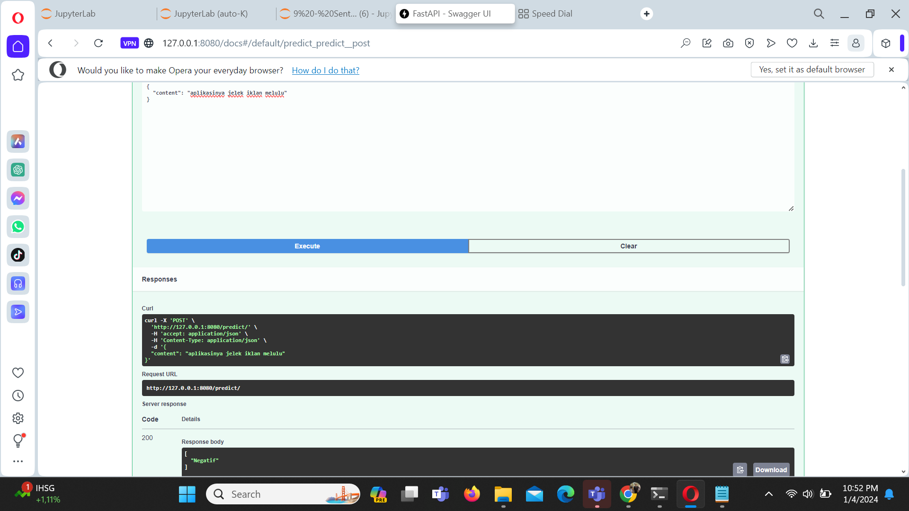
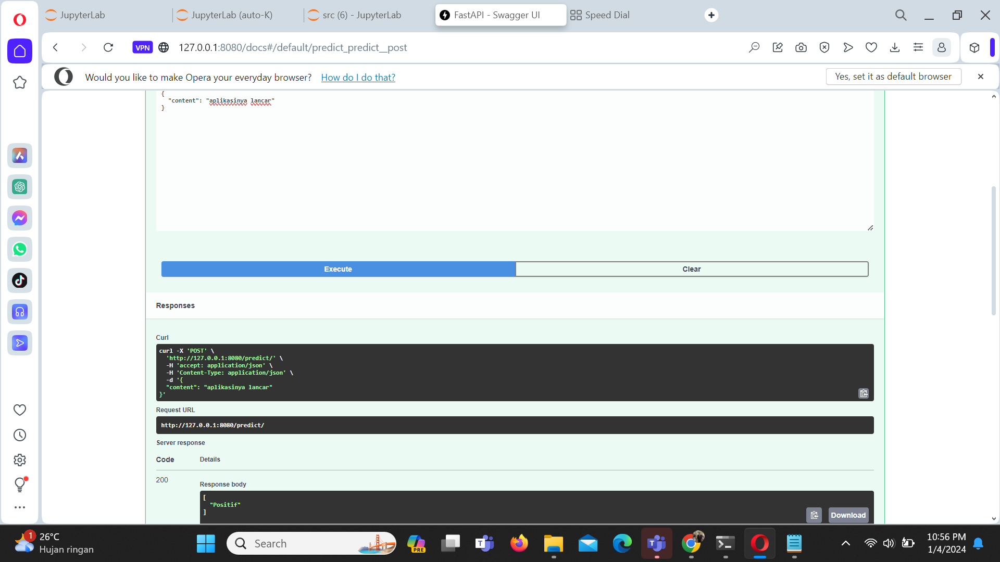
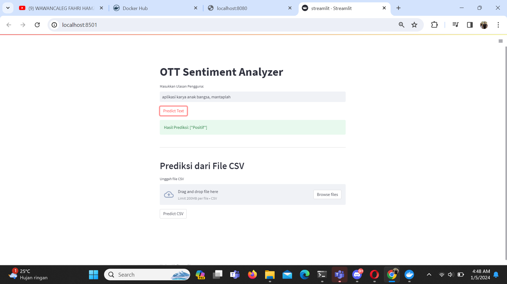
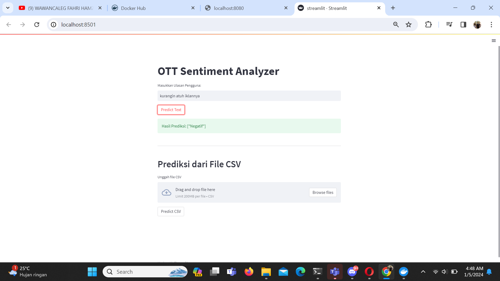
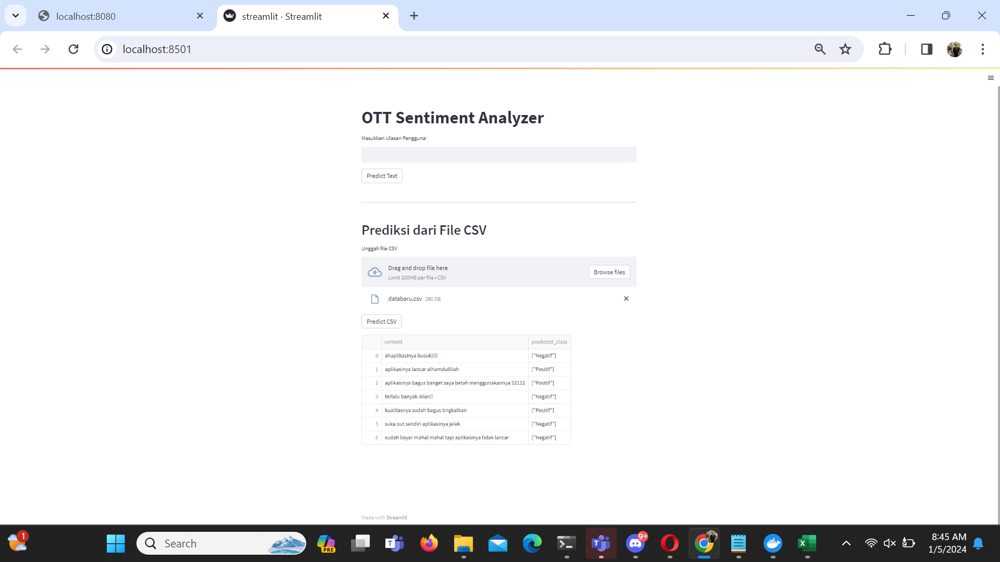
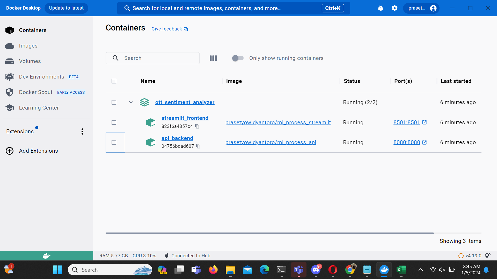
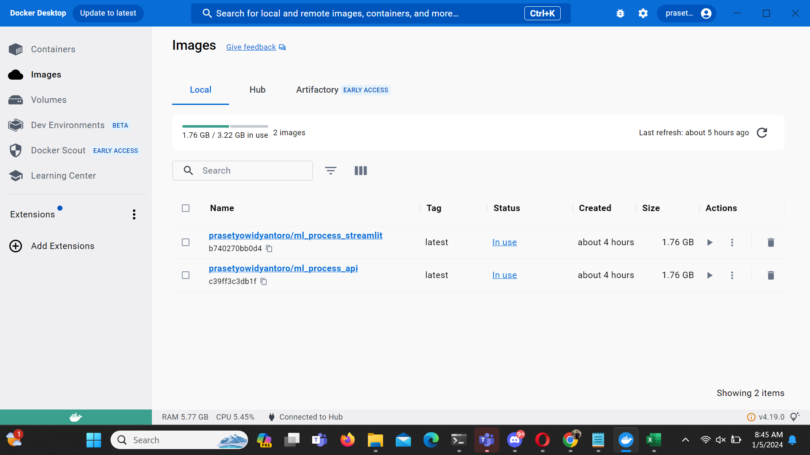

# OTT Sentiment Analyzer:Unveiling User Sentiments in Google Play Reviews

## Cara menjalankan Script Dilokal

### Konfigurasi Awal
- Buat satu folder untuk clone file-file yang tersedia pada laman github ini
- clone repository github ini
- instalasi virtual environment
- aktifkan virtual environment yang telah dibuat
- install requirements.txt dengan cara `pip install -r requirements.txt`
- file sudah dikonfigurasi, lanjutkan step dibawah ini sesuai dengan keinginan

## Penggunaan Docker

1. Pastikan sudah melakukan clone repository program ini
2. instalasi virtual environment
3. aktifkan virtual environment yang telah dibuat
4. install requirements.txt dengan cara pip install -r requirements.txt
5. pastikan docker sudah diaktifkan dan dalam kondisi login
6. lalu, jalankan melalui terminal yang sudah diaktifkan virtual environment dengan script berikut docker `compose up -d --build`
7. Machine Learning Service “Online Store Product Classification Using Multi-class Classification” siap untuk digunakan.
8. API : http://localhost:8080/docs dan UI Front End (Streamlit) : http://localhost:8501

**Prediksi menggunakan API dengan menggunakan FASTAPI**

Selanjutnya, setelah melalui beberapa proses dan model telah di save akan dilanjutkan pada deployment dengan menggunakan API dan Streamlit gambar dibawah ini merupakan contoh mengakses menggunakan ML Services melalui FAST API Swagger UI

Berikut contoh input data yang digunakan untuk mengakses API

Agar lebih ramah dalam menggunakannya dan tampilannya lebih powerfull, user disuguhkan dengan apps sederhana yang dibangun dengan menggunakan streamlit services, berikut contoh penggunaannya

**Prediksi menggunakan form yang telah disediakan**

**Prediksi menggunakan file CSV**

## Menggunakan Docker Container

Ketika service ingin dijalankan bersamaan, maka kita perlu menggunakan tools yang mendukung hal tersebut, salah satunya dapat menggunakan docker berikut contoh service sederhana yang dijalankan dengan bantuan docker

Berikut hasil input service ke docker container

Berikut hasil input service ke docker Image

## Referensi

- Liu B, Hu M, Cheng J (2005) Opinion observer: Analyzing and comparing opinions on the web In: Proceedings of the 14th International Conference on World Wide Web, WWW ’05, 342–351.. ACM, New York, NY, USA.

- Herlawati, H., Handayanto, R. T., Atika, P. D., Khasanah, F. N., Yusuf, A. Y. P., & Septia, D. Y. (2021). Analisis Sentimen Pada Situs Google Review dengan Naïve Bayes dan Support Vector Machine. Jurnal Komtika (Komputasi Dan Informatika), 5(2), 153–163. https://doi.org/10.31603/komtika.v5i2.6280

- Fransiska, S., & Irham Gufroni, A. (2020). Sentiment Analysis Provider by.U on Google Play Store Reviews with TF-IDF and Support Vector Machine (SVM) Method. Scientific Journal of Informatics, 7(2), 2407–7658. http://journal.unnes.ac.id/nju/index.php/sji
 
- https://github.com/Jalil98/Cendekiawan-Sentiment-Analysis-Using-Naive-Bayes/blob/main/Project_Freelance_NLP_Sentiment_Analysis_Naive_Bayes.ipynb

- https://github.com/Aannn31/Analisis-sentimen-Reksadana/blob/main/notebooks/Analisis-Sentimen-Aplikasi-Bibit.ipynb

- https://github.com/wandalistathea/analisis_sentimen_tokopedia/blob/main/ANALISIS%20SENTIMEN%20PENGGUNA%20TOKOPEDIA.ipynb

- https://github.com/sains-data/AnalisisSentimen-CNN-Kel3-RA/blob/main/Amazon_cnn_(1).ipynb

- https://github.com/okyx/Sentimen-Analisis/blob/main/Project1_ML_terapan.ipynb

- https://github.com/dhanikajeihan/Analisis-Sentimen-Deteksi-Target/blob/master/Analisis%20Sentimen.ipynb

- https://github.com/vikaasridevianti/Klasifikasi-Naive-Bayes-Lexicon-Based/blob/main/Analisis%20Sentimen_Vika%20Asri%20Devianti_065117200%20(lexicon%20based).ipynb

- https://github.com/Hadisw01/Analisis_Sentimen_Pendapat_Pengalaman_Kuliah_Hybrid/blob/main/Final_Project.ipynb

- https://www.analyticsvidhya.com/blog/2022/07/sentiment-analysis-using-python/

- https://medium.com/@joshuapn/sentiment-analyst-bahasa-indonesia-dengan-twitter-python-d75a9d6b437e

- https://realpython.com/python-nltk-sentiment-analysis/

- https://towardsdatascience.com/a-beginners-guide-to-sentiment-analysis-in-python-95e354ea84f6

- https://365datascience.com/tutorials/python-tutorials/sentiment-analysis-with-python/